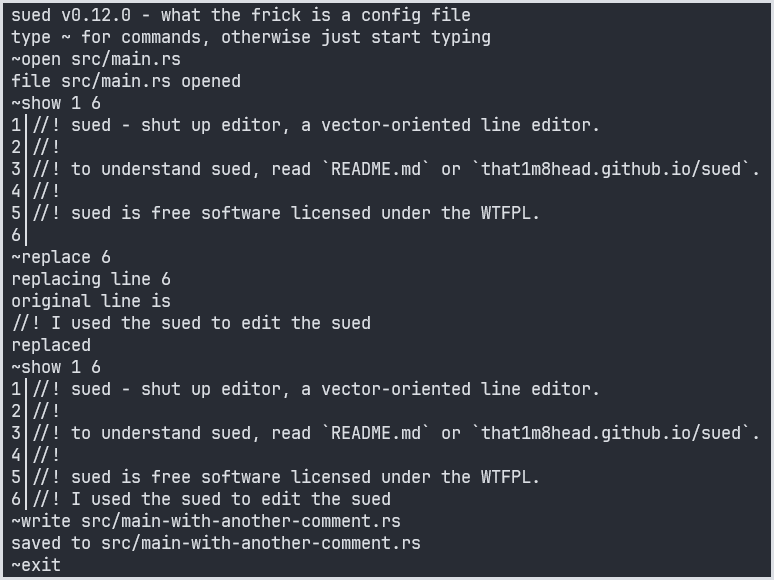

# sued - shut up editor

sued is a vector-oriented line editor, kind of similar to the venerable and standard ed text editor, just with a different command syntax and set, to provide a unique editing experience.

~~Yes, I know ed doesn't use vectors, shut up~~



Syntax highlighting? Code analysis? *Modal editing?* ***Cursor positioning??***

Who the hell cares? Just shut up and edit.

Written in Rust, because frick you, that's why.

## Obtaining

```bash
cargo install sued
```

and make sure that `~/.cargo/bin/` is in your PATH or you won't be able to run it until it is.

## Speed

sued is written in pure, idiomatic Rust. Its speed, as a compiled line editor, is pretty damn fast. As it should be.

## Power

sued looks basic on the offset, but under the hood, it has support for regex replacements, file searching, pretty-looking line numbers, and some other stuff.

## User-friendly

sued is much more user-friendly than ed - it's a modeless editor, so there's no complicated mode switching to keep in your head. It also uses a simple command syntax, with whole words, not single letters.

## No-nonsense

sued is designed to not get in your way. Error messages are useful but brief. They're not ed levels of brief, but they're still pretty brief.

## Ubiquitous (kinda)

Being a CLI app, you can run sued anywhere! In your terminal, in VS Code, in Emacs, even inside Vim! If it has a terminal, it can run sued.

## Documentation

sued's documentation is present [online](https://that1m8head.github.io/sued).
