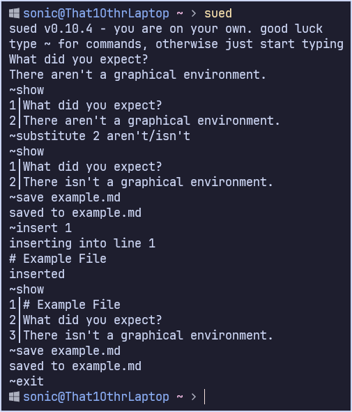

# sued - shut up editor

sued is a vector-oriented line editor, kind of similar to the venerable and standard ed text editor, just simpler and not nearly as powerful.

~~Yes, I know ed doesn't use vectors, shut up~~



Syntax highlighting? Code analysis? *Modal editing?* ***Cursor positioning??***

Who the hell cares? Just shut up and edit.

Written in Rust, because frick you, that's why.

## Obtaining

```bash
cargo install sued
```

and make sure that `~/.cargo/bin/` is in your PATH or you won't be able to run it until it is.

## Documentation

sued's documentation is present [online](https://that1m8head.github.io/sued).
